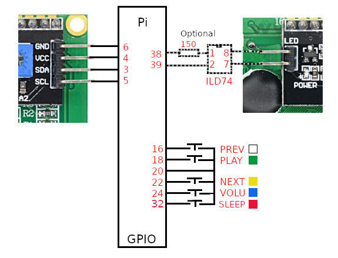
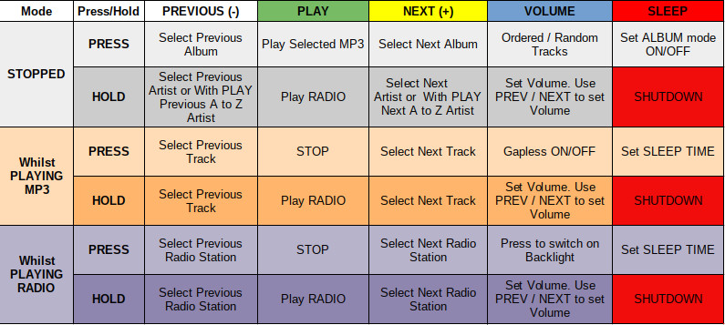
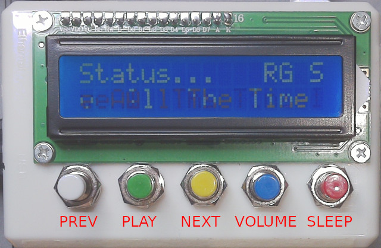
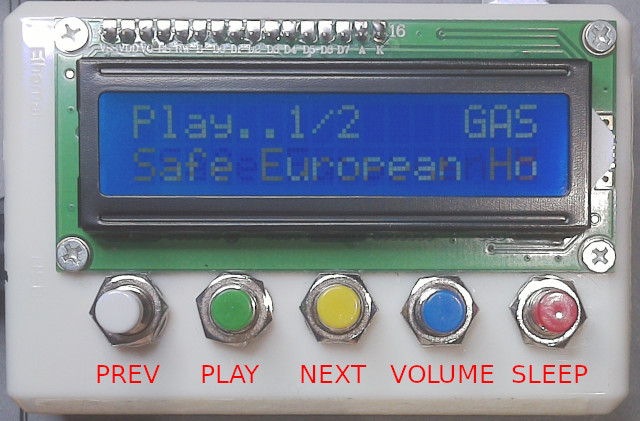

# Pi_5B_LCD_MP3_Player

Not for BOOKWORM 32bit, works with 64bit

A simple MP3 Player and Internet Radio Player using a Raspberry Pi, 5 buttons, and 1 I2C LCD, either 16x2 or 20x4.

All buttons are connected between gpios and gnd (1k resistors in series are usually recommended), LCD connected as shown. 
Backlight control (optional) via a opto-isolator, if not then leave the supplied link in place on the LCD.
If you try Pi_5B_LCD_MP3_Player2.py and that works OK you don't need to wire to the lcd hust leave the link in.

## schematic

5 button switches, PREVIOUS,PLAY,NEXT,VOLUME,SLEEP but they have multi purposes as shown.
## Button usage

## screenshot showing status... R for Random, G for Gapless,  S for SLEEP Timer set

## screenshot showing ALBUM MODE, GAPLESS ON and SLEEP Timer set.

At boot it will look for mp3 tracks in '/home/USERNAME/Music/artist name/album_name/tracks', 
and/or on a USB stick, under /media/USERNAME/usb_stick_name/artist name/album_name/tracks

To install copy 5B_LCD_MP3_player.py to /home/USERNAME

and then

sudo apt-get install python3-alsaaudio

sudo pip3 install rpi_lcd

sudo apt-get install mplayer

sudo pip3 install mutagen

enable i2c, Menu >> Preferences >> Raspberry Pi Configuration >> Interfaces >> i2c enable

to run python3 5B_LCD_MP3_player.py

to start at boot add /usr/bin/python3 /home/USERNAME/5B_LCD_MP3_player.py to /etc/xdg/lxsession/LXDE-pi/autostart
and ensure your Pi boots to the GUI
